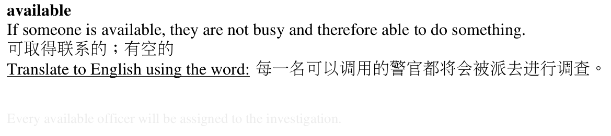

# practice-esl-vocab

IPython Notebook for generating a PDF practice sheet of vocabulary words. This is for practicing ENGLISH from fluency in another language.

The included list of words is from [EF Eduction First's list of 3000 common English words](https://www.ef.edu/english-resources/english-vocabulary/top-3000-words/). Any list can be used. Replace `words.txt`. You can delete words or add them to `burned.txt` to skip them. Words are not automatically added to `burned.txt` in any way, for now.

Scrapes from the Cambridge dictionary using BeautifulSoup. It is currently only set up for the English-Chinese (Simplified) dictionary. HTML attribute values likely need to be changed to be compatible with other bilingual Cambridge dictionary options.

Each practice sheet makes a PDF of a chosen number of words to practice. Output to the PDF for each word includes:

* English word (one randomly chosen definition, if multiple exist)
* English definition
* Foreign language definition
* A practice phrase to translate back into English (randomly chosen from the examples in the dictionary)
* The English translation of the phrase (with lowered opacity for printing out the practice sheet and not really being able to see the answer)

PDF is saved by the YYYY-MM-DD date and **will be overwritten if a file of the same name already exists**.

The [AR PL New Sung (firefly) font](http://www.study-area.org/apt/firefly-font/) is already included in the repository to support east Asian languages. See [PyFPDF documentation](https://pyfpdf.readthedocs.io/en/latest/Unicode/index.html) if other encodings are needed.

## Example entry

### Author
Written by [Dan Fu](mailto:daniel.fu@duke.edu)
